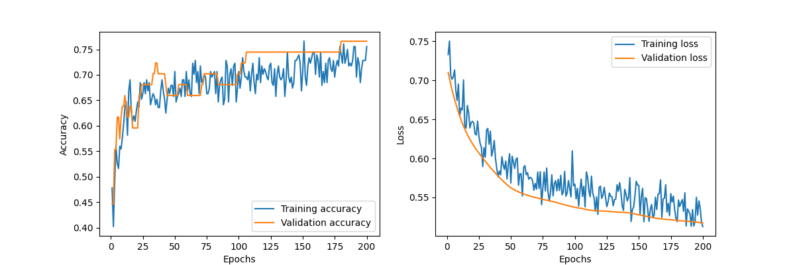

# Title: South African Heart Disease Prediction Model

Author: James Clarke

## Part 1: Implementation

### Background

The South African Heart Disease dataset was used to build and train a neural network model for predicting heart disease. The dataset contains 462 records, with 10 attributes, such as systolic blood pressure, tobacco usage, low-density lipoprotein cholesterol, adiposity, family history of heart disease, type of personality, obesity, alcohol consumption, age, and the presence or absence of coronary heart disease (CHD).

### Data Preparation and Technique

The data was first downloaded from the OpenML repository, loaded into a Pandas DataFrame, and preprocessed. The family history attribute was mapped to binary values, and the presence or absence of CHD was also mapped to binary values. The dataset was then split into training and test sets, with the data being normalized using the StandardScaler from the scikit-learn library. A neural network model was built using the TensorFlow and Keras libraries, with dropout layers for regularization.

The following libraries were used in this implementation:

- pandas
- numpy
- requests
- io
- scipy
- sklearn
- tensorflow
- matplotlib
- pickle
- csv

### Results

The neural network model was trained for 200 epochs, using early stopping based on the validation loss with a patience of 5 epochs. The training accuracy of the model was found to be ~70%. The training and validation accuracy and loss values were written to a CSV file, and the trained model was saved to an HDF5 file.

### Conclusion

This implementation demonstrates the process of building and training a neural network model for predicting heart disease using the South African Heart Disease dataset. The model achieves a satisfactory level of accuracy and can be used as a starting point for further improvements and fine-tuning.

#### Captures of Implementation and Results

[Include screenshots of the code execution, displaying the DataFrame, model training output, and the resulting plots for accuracy and loss.]

#### First training Session

The first training session was the base model with 50 epochs. 

### Second Training Session

Second training session was with 50 epochs, with early stopping and Batch Gradient Descent.  

### Third Training Session

Third training session was with 100 epochs, with early stopping and Batch Gradient Descent.

### Fourth Training Session

Forth training session was with 200 epochs(actually did 35 due to early stopping), with early stopping and Batch Gradient Descent. 

### Fifth Training Session

Fifth training session was with 200 epochs(actually did 50 due to early stopping), with early stopping and Batch Gradient Descent. A dropout layer with 25% was added to make it so the network was not dependent on any one neuron or set of features.

### Sixth Training Session

Sixth training session was with 200 epochs, with early stopping and Batch Gradient Descent. A dropout layer with 50% was used. And 16 neurons were added to make the network more robust.